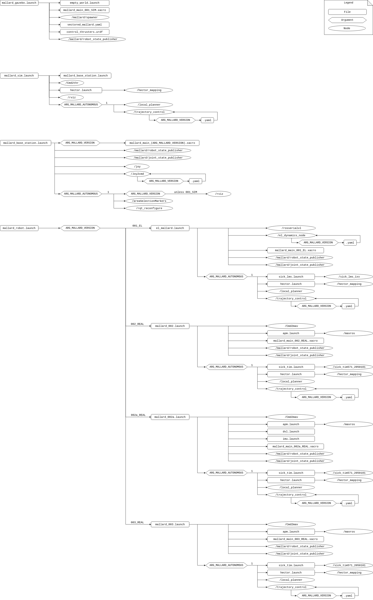
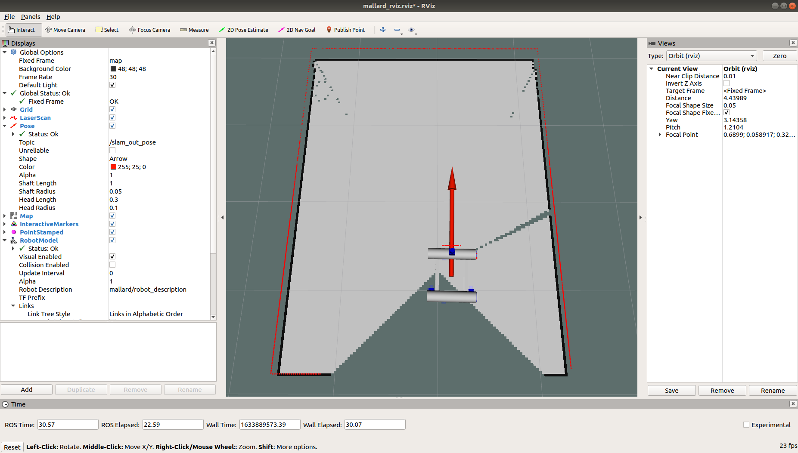
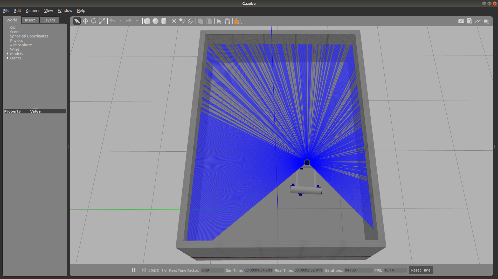
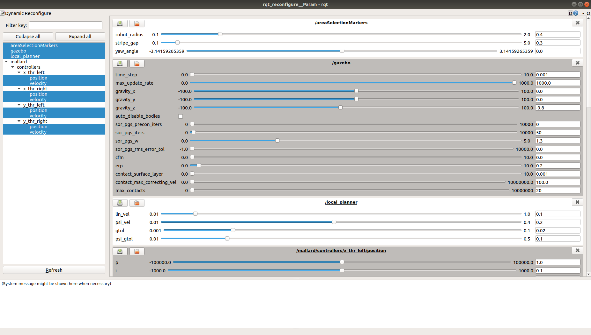
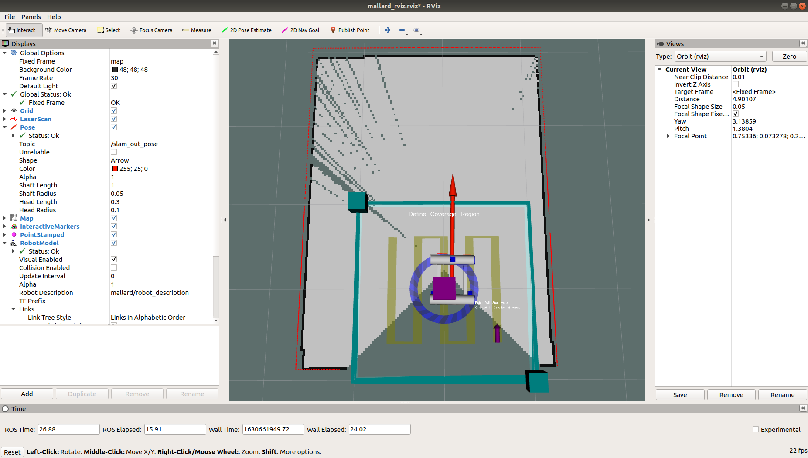
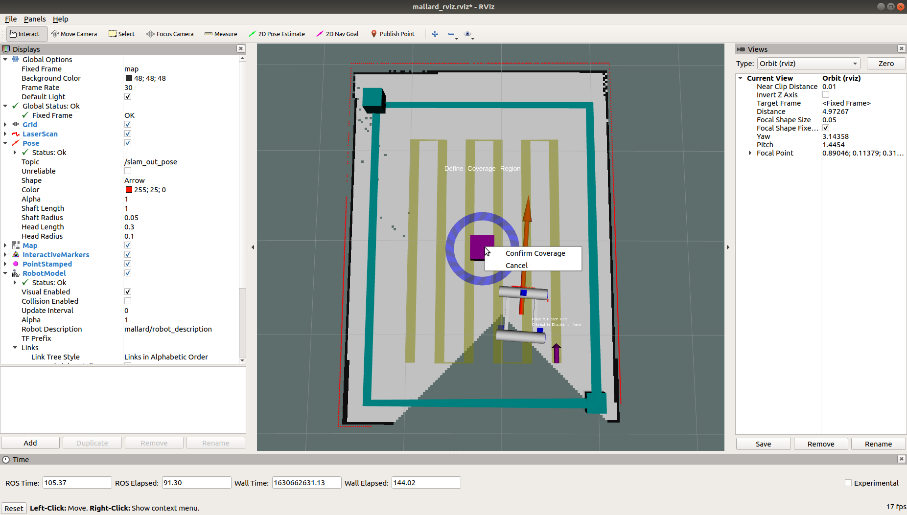
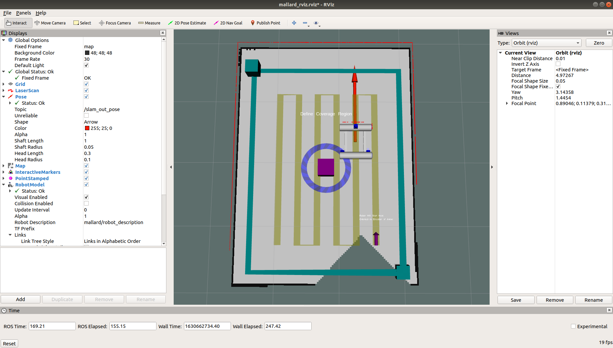
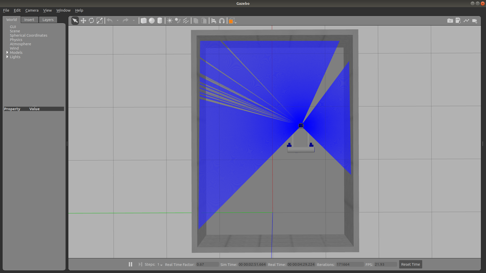
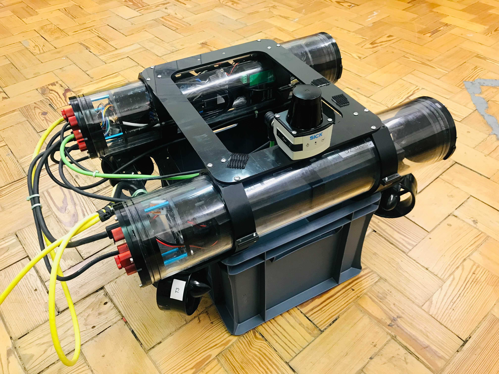
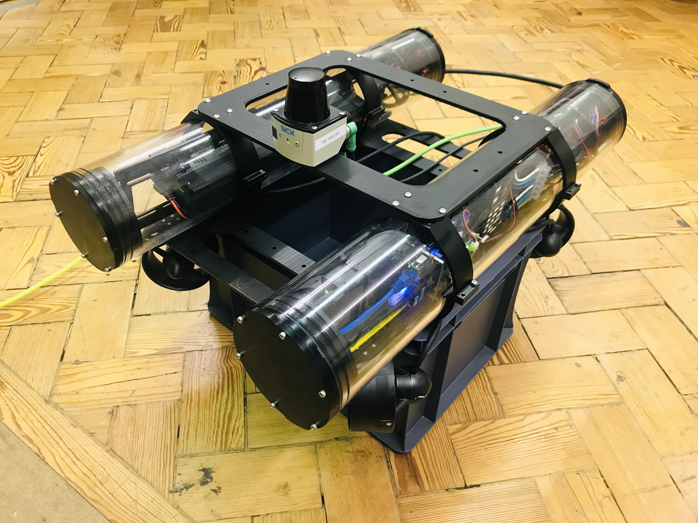

## Overview

This repository contains packages to run different versions of MallARD in simulation and in real world. This work was built and tested on Ubuntu 18.04 with ROS Melodic (for MallARD) and Ubuntu Mate with ROS Kinetic (for El-MallARD).  

### MallARD versions
- MallARD-001 is the first MallARD that was built and has a thruster layout that was designed for efficiency. The code for real MallARD-001 has not been updated in this repo and only exists here in simulation.  
- MallARD-002 has a new thruster layout as described in [this paper](https://www.mdpi.com/2218-6581/8/2/47).  
- MallARD-003 is the NNUF (National Nuclear User Facility) owned MallARD that lives in Cumbria. MallARD-003 is very similar to MallARD-002 except the pontoons are flipped by 90 degrees. The thrusters relative to the lidar remains the same which means that the code is essentially the same.
- El-MallARD, the ground version of MallARD, is an omnidirectional ground vehicle which can simulate the behaviour of MallARD on the water.
- MallARD-002a is a modified version of MallARD-002 that incorporates an IMU and a DVL. (MallARD-002a is not currently working (12/04/2022).)
- Simulation is available for MallARD-001 only at present.


For the instruction for El-MallARD, go to [README_El-MallARD.md](README_El-MallARD.md).  
For the instruction for MallARD-002, go to [README_MallARD-002.md](README_MallARD-002.md).   
For the instruction for MallARD-003, go to [README_MallARD-003.md](README_MallARD-003.md).  

-----

## Essential tools
**Before you continue**, please check the followings.

### ROS
Make sure you have installed [ROS Melodic](http://wiki.ros.org/melodic/Installation/Ubuntu) (Kinetic for El-MallARD onboard computer) before you move on. You can also refer to this [ROS installation guide](https://github.com/EEEManchester/ROS_Beginner_Teaching_Materials/blob/main/2.%20Installing%20ROS.md).

### rosdep
Make sure you have followed 1.6 of the [ROS guide](http://wiki.ros.org/melodic/Installation/Ubuntu) when you installed ROS so that you have essential tools such as `rosdep`.

### ssh key
It is recommended to use SSH keys to clone Git repositories. Please refer to [Generating a new SSH key](https://docs.github.com/en/authentication/connecting-to-github-with-ssh/generating-a-new-ssh-key-and-adding-it-to-the-ssh-agent) for details.

You can set up an SSH key for your machine as follows.   

On a terminal of your machine, run each of the following commands.
```
ssh-keygen -t ed25519 -C "<email address>" 
# press enter and type a passphrase twice

eval "$(ssh-agent -s)" 

ssh-add ~/.ssh/id_ed25519
# enter the passphrase

cat ~/.ssh/id_ed25519.pub
# COPY the output. This is the SSH public key.
``` 

On the GitHub web page,  
- Click your profile photo.
- Click **Settings**.
- In the "Access" section of the sidebar, click **SSH and GPG keys**.
- Click **New SSH key**.
- In the "Title" field, add a descriptive label for the new key (e.g. Personal MacBook Air).
- Paste your key into the "Key" field.
- Click **Add SSH key**.
- If prompted, confirm your GitHub password.


### vcstool
[vcstool](http://wiki.ros.org/vcstool) is used to clone the required repositories. If you don't have it yet, please install it.
```
sudo apt-get update
sudo apt-get install python3-vcstool
```

### catkin tools
This project is built using [catkin_tools](https://catkin-tools.readthedocs.io/en/latest/installing.html). Make sure to have `catkin tools` installed before continuing.

-----

## Installation
### Clone this repository
Make a new catkin workspace (`mallard_ws` is used here as an example) and change directory to the `/src` folder of your catkin workspace. Then clone this repository.

```
mkdir -p ~/mallard_ws/src
cd ~/mallard_ws/src
git clone git@github.com:EEEManchester/MallARD.git
```


### Install required repositories
You will find the follwing `.repos` installation files in `MallARD/install/repos` folder. Each .repos file contains information pointing to the required repositories to clone for the corresponding use case.

- `sim.repos`: Installation file for **simulation**. It points to the following repositories. 
    - [freefloating_gazebo](https://github.com/EEEManchester/freefloating_gazebo)
- `mallard.repos`: Installation file for a **MallARD**'s computer. It points to the following repositories. 
    - [mavlink](https://github.com/mavlink/mavlink-gbp-release/tree/release/melodic%2Fmavlink)
    - [mavros_mallard](https://github.com/EEEManchester/mavros_mallard)

If you want to use **simulation**, use `sim.repos` on the **base station** computer.  
If you want to use a **MallARD**, clone this MallARD repo on the **base station** computer and `mallard.repos` on the **MallARD**'s onboard computer.  
If you want to use an **El-MallARD**, clone this MallARD repo on **both** the **base station** computer and the **El-MallARD**'s onboard computer.

You can do the installation using the follwing command.   
For example of simluation, on the base station,
```
cd ~/mallard_ws/src
vcs import --skip-existing --input MallARD/install/repos/sim.repos
```


### rosdep and build
Install dependacy packages using `rosdep`.
```
cd ~/mallard_ws
rosdep install --from-paths src --ignore-src -r -y
```

If you are on a MallARD's computer and used `mallard.repos` for installation, run the following command. Otherwise, skip to the next commands.
```
sudo ~/mallard_ws/src/mavros_mallard/mavros/scripts/install_geographiclib_datasets.sh
# insert password
```

Build the pakcages of the repositories cloned.
```
catkin build
source devel/setup.bash 
```

#### Tips
You can check if your workspace is properly overlayed by checking the ROS_PACKAGE_PATH environment variable.
```
echo $ROS_PACKAGE_PATH 
```
You should be able to see something similar to the following.
```
/home/(user)/mallard_ws/src..
```
Now your workspace is recognised by the computer.


### Tips: General solution for missing packages
You can check whether a package is missing or not by running the following code:
```
rospack list | grep package-name
```

In general, you should be able to install a ros package using the following command.
```
sudo apt update
sudo apt install ros-melodic-package-name
```


## .bashrc setup
Add the following to `.bashrc` file on the `base station` computer if it has not been added yet. You can open `.bashrc` using `gedit ~/.bashrc` command on a terminal.

```
#For ROS path
source ~/mallard_ws/devel/setup.bash

#For default Environment Variable setup
export MALLARD_VERSION='001_SIM'
export MALLARD_AUTONOMOUS=1

export ROS_MASTER_URI=http://localhost:11311
export ROS_HOSTNAME=localhost

#For Simulation setup
alias setmassim='export ROS_MASTER_URI=http://localhost:11311 && export ROS_HOSTNAME=localhost'
alias setversim='export MALLARD_VERSION='001_SIM''

#For El-MallARD setup
alias setmasel='export ROS_MASTER_URI=http://10.42.0.1:11311 && export ROS_HOSTNAME=10.42.0.205'
alias setverel='export MALLARD_VERSION='001_EL''
alias pingel='ping 10.42.0.1'
alias sshel='ssh -A el-mallard@10.42.0.1'
alias sshfsel='sshfs el-mallard@10.42.0.1:/home/el-mallard ~/ssh_mount'

#For MallARD (002 & 003) setup
alias setmas002='export ROS_MASTER_URI=http://192.168.0.83:11311 && export ROS_HOSTNAME=192.168.0.89'
alias setver002='export MALLARD_VERSION='002_REAL''
alias ping002='ping 192.168.0.83'
alias ssh002='ssh -A mallard@192.168.0.83'
alias sshfs002='sshfs mallard@192.168.0.83:/home/mallard ~/ssh_mount'

alias setmas003='export ROS_MASTER_URI=http://192.168.0.83:11311 && export ROS_HOSTNAME=192.168.0.89'
alias setver003='export MALLARD_VERSION='003_REAL''
alias ping003='ping 192.168.0.83'
alias ssh003='ssh -A keir@192.168.0.83'
alias sshfs003='sshfs keir@192.168.0.83:/home/keir ~/ssh_mount'


#To change between autonomy setups
alias setman='export MALLARD_AUTONOMOUS=0'
alias setauto='export MALLARD_AUTONOMOUS=1'

#For sshfs unmount
alias sshfsunmount='fusermount -u ~/ssh_mount'

#For base station launch
alias start_basestation='roslaunch launch_config mallard_base_station.launch'
alias start_gazebo='roslaunch launch_config mallard_gazebo.launch'
alias start_sim='roslaunch launch_config mallard_sim.launch'
```


When you have added the above, source the file using the following command.
```
source ~/.bashrc
```

## Environment Variables and Arguments
There are two environment variables which are used to determine launch setups for different circumstances. The environment variables can be changed by modifying the `.bashrc` file.  
`MALLARD_VERSION`: The version of the MallARD. This is differently set for different robots. E.g. '003_REAL' for MallARD-003.  
`MALLARD_AUTONOMOUS`: 0 is Manual Mode. 1 is Autonomous Mode.


And there are two arguments to get the values of the corresponding environment variables.  
`ARG_MALLARD_VERSION`  
`ARG_MALLARD_AUTONOMOUS`

Depending on the values of the arguments, the launch setups change.  

### Tips:
To check that the environment variables for the robot with their values, run the following command.
```
env | grep MALLARD
```

To change the values of environment variables for the current terminal only, you can use the following examples.
```
# To set ROS master/host addresses
setmassim
setmasel
setmas002
setmas003

# To set the version of the MallARD
setversim
setverel
setver002
setver003
```

To make persistent changes for new terminals as well, change the values of the environment variables in `~/.bashrc` directly. 

You can change the autonomy setting on any of the computers using the following commands.
```
# To switch to Autonomous Mode for the computer by setting MALLARD_AUTONOMOUS to 1
setauto 

# To switch to Manual Mode for the computer by setting MALLARD_AUTONOMOUS to 0
setman  
```

Depending on the value of `MALLARD_VERSION`, a yaml file is chosen. The yaml file has parameters for the corresponding MallARD's control such as the joystick gains and/or for velocity control (`~/mallard_ws/src/MallARD/el_mallard/src/el_dynamics.py`).
You can modify the yaml files which are at `~/mallard_ws/src/MallARD/launch_config/(MallARD version)/cfg/yaml`


## Launch Process

The following diagram shows the launch process of MallARD in terms of launch files, arguments, and nodes.



There are four main launch files. 

- `mallard_gazebo.launch`: For simulation. It brings a simulated world using Gazebo and a simulated MallARD with its defined model. This launch file is launched using an alias command `start_gazebo`.

- `mallard_sim.launch`: For simulation. It makes the MallARD alive. It calles the base station launch and runs nodes for thruster control, RViz, and autonomous mode (e.g. SLAM). This launch file is launched using an alias command `start_sim`.

- `mallard_base_station.launch`: For the base station (e.g. your laptop). It loads the corresponding robot model for visualisation in RViz and runs nodes for joypad inputs and autonomous mode. This launch file is launched using an alias command `start_basestation`.

- `mallard_robot.launch`: For the robot computer (e.g. a Raspberry Pi or an UP board on a MallARD). It calls corresponding launch file for the robot, which leads to loading the corresponding robot model for transformations and running nodes for thruster control and autonomous mode. This launch file is launched using an alias command `start_robot`.


For **simulation**, `mallard_gazebo.launch` and `mallard_sim.launch` are launched. For a **real robot**, `mallard_robot.launch` and `mallard_base_station.launch` are launched. Detailed launch processes are addressed in the following chapter.


-----

## Run Simulation

### Run MallARD in Simulation as Manual Mode
Follow the steps below.

1. In a terminal(Terminal 1):
```
#set environment variables for simulation
setmassim  

#start Gazebo
start_gazebo
```
2. Wait for Gazebo to fully apper. 

3. Connect a joypad to the base station. 

4. In another terminal(Terminal 2):
```
#set environment variables for simulation
setmassim
setversim

#set to Manual Mode for the current terminal
setman

#start simulation
start_sim
```

You should see windows similar to the followings: 

#### Gazebo
 

#### RViz
 

5. The simulated MallARD in Gazebo and its representation in RViz should move as you control with the joypad (Left joystick for linear movement and Right joystick for rotation). 

After use,

6. Shutdown the processes by pressing Ctrl + C in all the terminals.


### Error
If you get the folloing error message when launching mallard_gazebo.launch,
```
[Err] [REST.cc:205] Error in REST request

libcurl: (51) SSL: no alternative certificate subject name matches target host name 'api.ignitionfuel.org'
```
refer to [ROS_Beginner_Teaching_Materials/GazeboErrors.md](https://github.com/EEEManchester/ROS_Beginner_Teaching_Materials/blob/main/GazeboErrors.md). 


-----

### Run MallARD in Simulation as Autonomous Mode
Follow the steps below.

1. In a terminal(Terminal 1):
```
#set environment variables for simulation
setmassim  

#start Gazebo
start_gazebo
```
2. Wait for Gazebo to fully apper. 

3. Connect a joystick to the base station. 

4. In another terminal(Terminal 2):
```
#set environment variables for simulation
setmassim
setversim

#set to Autonomous Mode for the current terminal
setauto

#start simulation
start_sim
```

You should see windows similar to the followings: 

#### Gazebo
 

#### rqt


#### RViz
 

5. The simulated MallARD in Gazebo and its representation in RViz should move as you control with the joypad (Left joystick for linear movement and Right joystick for rotation). 

6. Move the trajectory and adjust the size of it appropriately by dragging the purple cube and one of the green cubes. When the starting point (purple arrow) is too close to the wall, the robot cannot get to the point and hence cannot start following the trajectory.



7. Right Click on the purple cube in the RViz window and Click 'Confirm Coverage' to start autonomous trajectory following. You can cancel autonomous trajectory following by Right Click on the purple cube and Click 'Cancel'.  

The robot will start moving to the starting point (purple arrow) and start moving along the trajectory (yellow lines). The red arrow represents the heading of the robot. You should be able to see the robot moving in Gazebo as well.




After use,

8. Shutdown the processes by pressing Ctrl + C in all the terminals.


### Tips: Gazebo Real Time Factor
If the gazebo simulation seems slow, check `Real Time Factor` at the bottom of the Gazebo window. If it is < 1.0, it means the simulation time is slower than the real time. The reason might be because your computer is not capable enough to run (or play) the simulation with the real speed.

One way to resolve the issue is as follows.
Go to `World` tab > `Physics` > and change `real time update rate` to 0.


-----
## El-MallARD 
El-MallARD is the ground version of MallARD, which mimics the behaviour of MallARD.  
For the instruction for El-MallARD, go to [README_El-MallARD.md](README_El-MallARD.md) 


## MallARD-002 
MallARD-002 is the second version of MallARD.  
For the instruction for MallARD-002, go to [README_MallARD-002.md](README_MallARD-002.md) 

 


## MallARD-003 
MallARD-003 is the latest version of MallARD at the time of writing.  
For the instruction for MallARD-003, go to [README_MallARD-003.md](README_MallARD-003.md) 

 

-----
## Issues
### TF timing issue
There is a timing issue with TF from 'laser' to 'map' frame in RViz.
```
Transform [sender=unknown_publisher]
For frame [laser]: No transform to fixed frame [map]. TF error: [Lookup would require extrapolation into the future. Requested time 1653485930.601544959 but the latest data is at time 1653485930.500381305, when looking up transform from frame [laser] to frame [map]]
```

#### Current fix
A separate scan for RViz is published with the same laser scan data but with a time delay (e.g. 0.5s).

-----

## Warnings
### Warning while building the packages
The following warning occurs while building the packages.
```
CMake Warning (dev) at /usr/share/cmake-3.10/Modules/FindBoost.cmake:911 (if):
  Policy CMP0054 is not set: Only interpret if() arguments as variables or
  keywords when unquoted.  Run "cmake --help-policy CMP0054" for policy
  details.  Use the cmake_policy command to set the policy and suppress this
  warning.

  Quoted variables like "chrono" will no longer be dereferenced when the
  policy is set to NEW.  Since the policy is not set the OLD behavior will be
  used.
```

### Warning when launching mallard_gazebo.launch
The following warning occurs when launching `mallard_gazebo.launch` (when using `start_gazebo`).
```
: The root link base_link has an inertia specified in the URDF, but KDL does not support a root link with an inertia.  As a workaround, you can add an extra dummy link to your URDF.
```
