# El-MallARD
El-MallARD, the ground version of MallARD, is an omnidirectional ground vehicle which can simulate the behaviour of MallARD on the water.

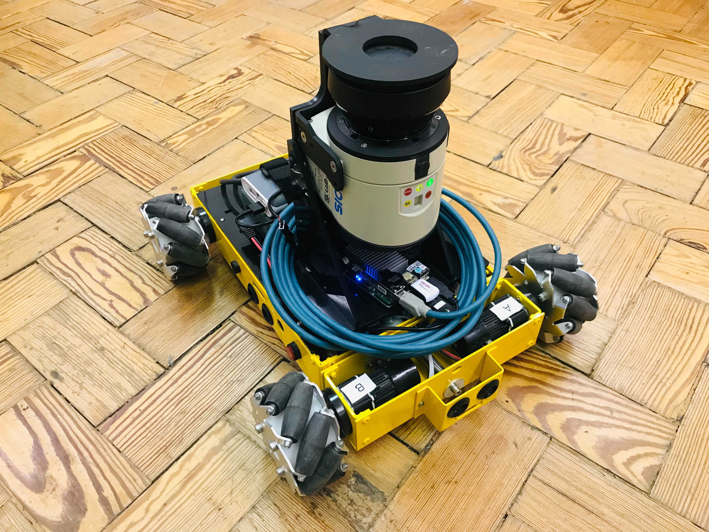


**Please make sure you have followed [README.md](README.md) upto *.bashrc setup* section first.**  
For **passwords**, ask **Keir Groves**.  
For a **quick start**, go to **Connect MallARD**.

-----

## .bashrc setup
Add the following to `.bashrc` file on the `El-MallARD`'s computer if it has not been added yet. You can open `.bashrc` using `gedit ~/.bashrc` command on a terminal.
```
#For ROS path
source ~/mallard_ws/devel/setup.bash

#For default Environment Variable setup
export ROS_MASTER_URI=http://10.42.0.1:11311 
export ROS_HOSTNAME=10.42.0.1

export MALLARD_VERSION='001_EL'
export MALLARD_AUTONOMOUS=1

#For Autonomy setup
alias setman='export MALLARD_AUTONOMOUS=0'
alias setauto='export MALLARD_AUTONOMOUS=1'

#For robot launch
alias start_robot='roslaunch launch_config mallard_robot.launch'

#For shutdown
alias shut_robot='sudo shutdown -h now'
```


When you have added the above, source the file using the following command.
```
source ~/.bashrc
```


-----

## Run MallARD
### Connect MallARD
On El-MallARD, 

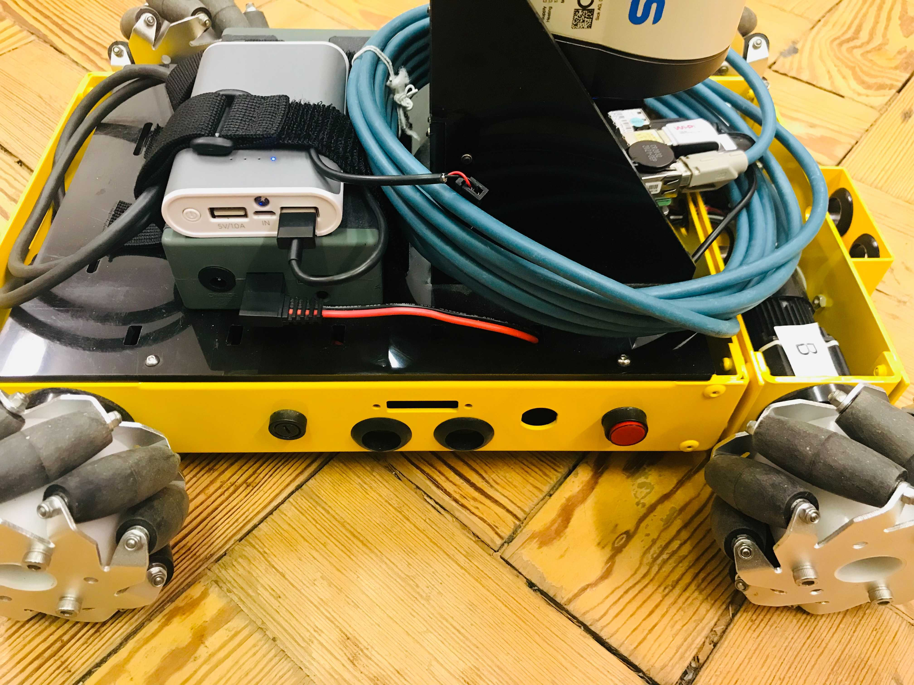

1. Connect the UP board to the power bank (smaller battery, 5V/2.4A port, black USB cable) and wait for 1 minute. Check if the UP board's blue LED is on.

2. Connect El-MallARD's body to the battery (bigger battery, red-and-black cable).

3. Turn on El-MallARD by pressing the RED button on the side of El-MallARD and wait for 30 seconds. Check if the Lidar's green LED is on.


### IP setup
El-MallARD is connected to the base station via Wifi (wireless connection) called `elmallard-UP-CHT01` which is the hotspot generated by El-MallARD. Currently, the white WiFi dongle labled as 'El-MallARD Hotspot' connected to the UP board is used for the hotspot. Make sure the wifi dongle is connected.

On **El-MallARD**, the wired network needs to be set as follows (**It should have already been set on El-MallARD.**).

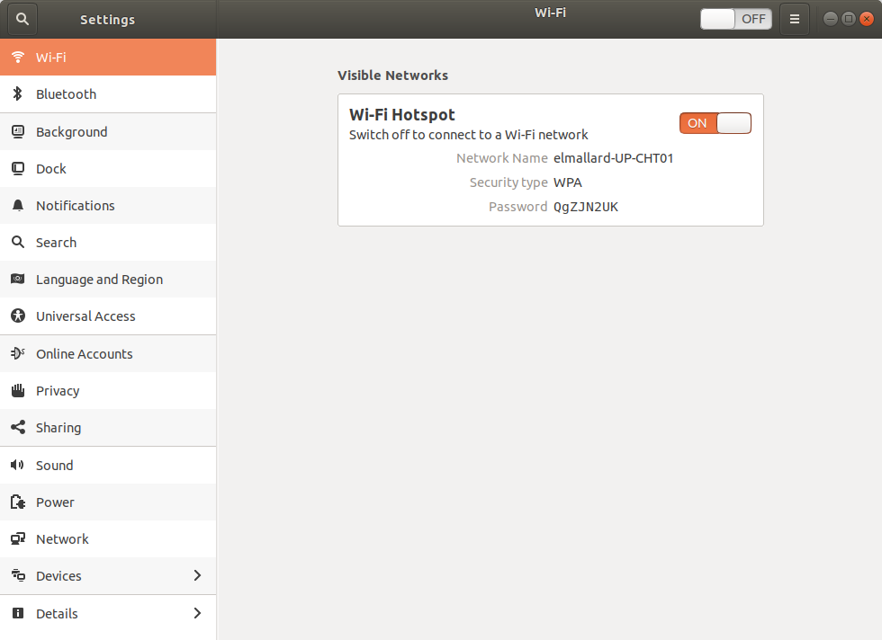


On the **base staion**, the WIFi needs to be set as follows.  

Connect to `elmallard-UP-CHT01`.  
When you first connect to this wifi, you will be prompted to put the password for the wifi (QgZJN2UK) (and might need to put the password of your computer). When connected for the first time, refresh Wi-Fi by turning off and on to save the setting for 'elmallard-UP-CHT01' properly. 

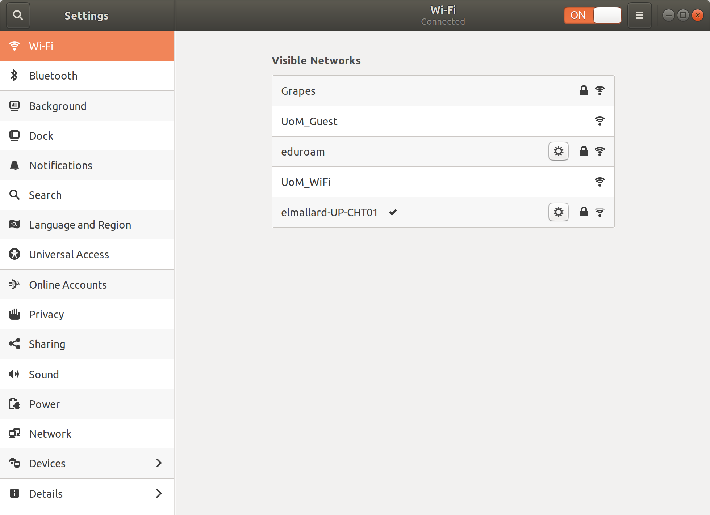


Set `IPv4` of `elmallard-UP-CHT01` as follows.

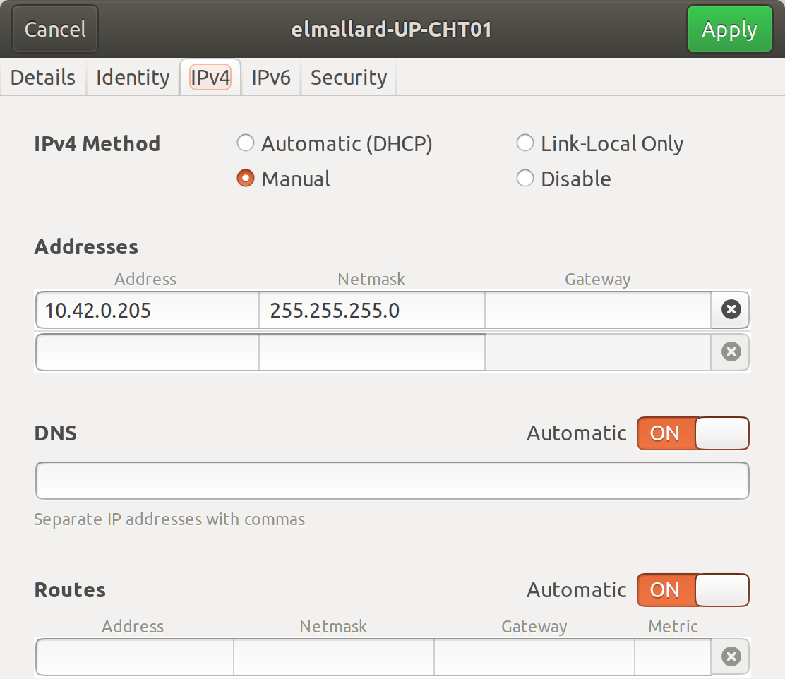


### Run El-MallARD as Manual Mode

On the base station, 

1. Connect a joystick to the base station.

2. In a terminal(Terminal 1), run the following commands and wait for 30 seconds for it to be fully launched.
```
sshel
# insert password. When conneting for the first time, you might need to insert 'yes' first.
# now you are in the robot's onboard computer.

#set to Manual Mode for the current terminal
setman

#start robot
start_robot
```

3. In another terminal(Terminal 2), run the following commands.
```
#set environment variables to use El-MallARD
setmasel
setverel

#set to Manual Mode for the current terminal
setman

#start basestation
start_basestation
```

4. El-MallARD should move as you control with the joypad (Left joystick for linear movement and Right joystick for rotation).   

After use,

5. Shutdown the processes by pressing Ctrl + C in the terminals.

6. Shutdown El-MallARD's onboard computer (UP board) properly with the following command in Terminal 1.
```
shut_robot
# insert password
```

Wait 1+ minutes for the UP board to completely shutdown.

7. Turn off El-MallARD's body by pressing the red button.

#### Control Modes and Buttons 
El-MallARD has two control modes: `Velocity Control Mode` and `Boat Mode`. You can toggle between the modes using buttons on the joypad.

`Velocity Control Mode`(default): Button `L1`    
The scaled joystick inputs indicates the body velocities and are directly converted to the wheel velocities.

`Boat Mode`: Button `R1`    
The behaviour of MallARD on water is implemented.  
The body velocities are calculated using the previous velocities, inertia and drag as well as the current input velocities (scaled joystick inputs) and then converted to the wheel velocities.

`Stop`: Button `X`     
The wheels of the robot immediately stop with all the velocities set to 0. 


### Run El-MallARD as Autonomous Mode
On the base station, 

1. Connect a joystick to the base station.

2. In a terminal(Terminal 1), run the following commands and wait for 30 seconds for it to be fully launched.
```
sshel
# insert password
# now you are in the robot's onboard computer.

#set to Autonomous Mode for the current terminal
setauto

#start robot
start_robot
```

3. In another terminal(Terminal 2), run the following commands.
```
#set environment variables to use El-MallARD
setmasel
setverel

#set to Autonomous Mode for the current terminal
setauto

#start basestation
start_basestation
```

You should see windows similar to the followings:

#### rqt
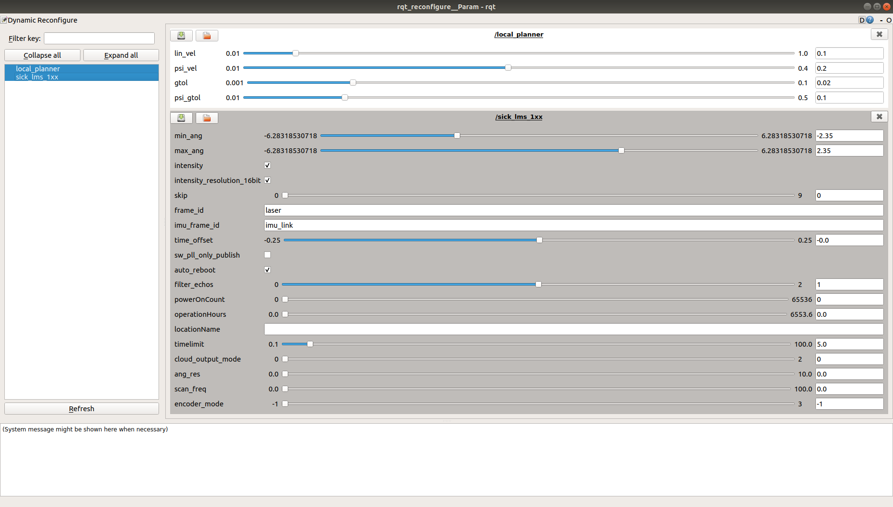 

#### RViz
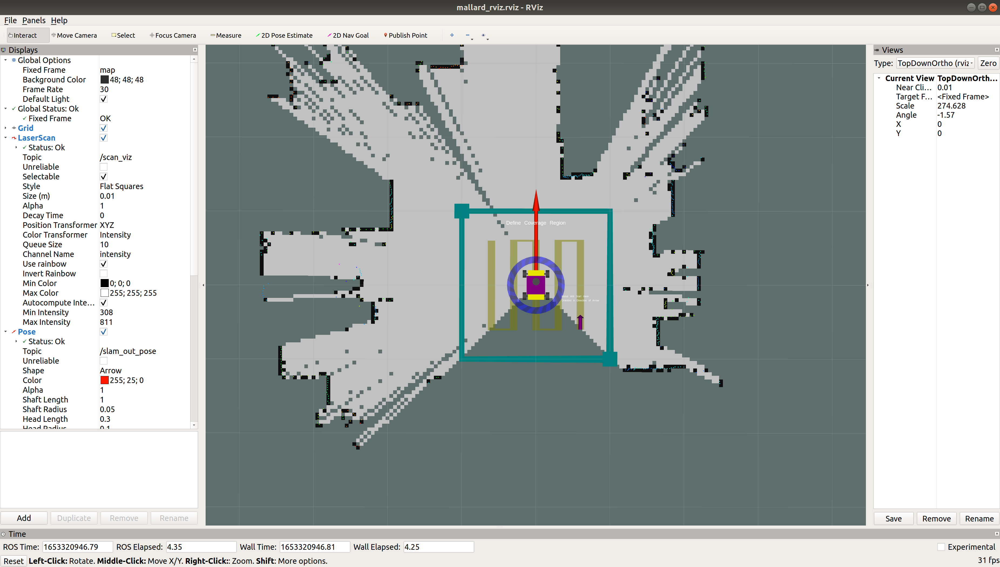 

4. El-MallARD and its representation in RViz should move as you control with the joypad (Left joystick for linear movement and Right joystick for rotation).  

5. Adjust the trajectory as you wish by dragging the purple cube, the green cubes, or the blue circle.

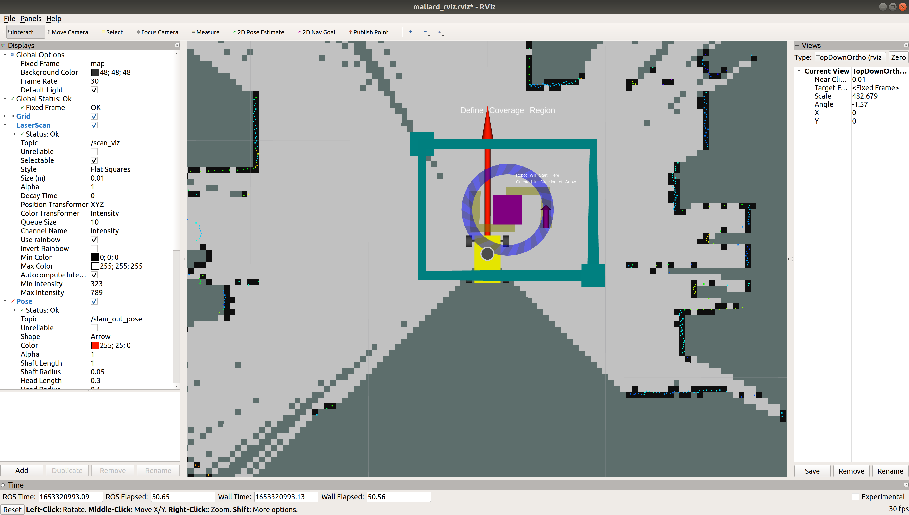 

6. **Make sure you change to `Boat Mode`** by pressing joypad button 'R1'.

7. Right Click on the purple cube in the RViz window and Click 'Confirm Coverage' to start autonomous trajectory following. You can cancel it by Right Click on the purple cube and Click 'Cancel'.


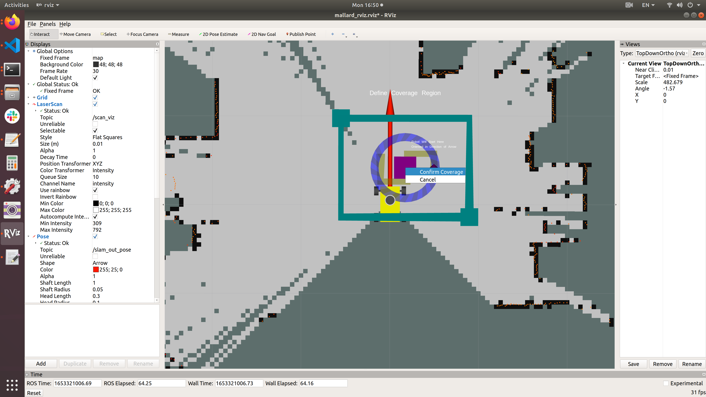 

Then the robot will start moving to the starting point (purple arrow) and start moving along the trajectory (yellow lines). The red arrow represents the heading of the robot. You should be able to see the real El-MallARD moving.

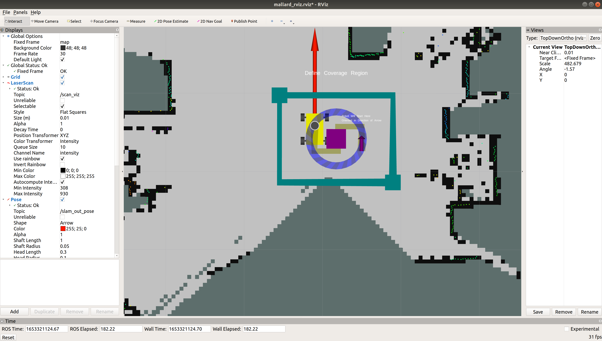 

8. Follow the steps 5 to 7 of **Run El-MallARD as Manual Mode**. 

---
## Fixing the map
When MallARD tilts on the water, it might see outside beyond the wall, which can cause its map being distorted and hence its localisation failing. To prevent this, you can fix the current map by stopping the map being updated. You can do this by increasing the angle and distance thresholds for the map to update. Refer to [EEEManchester/hector_slam](https://github.com/EEEManchester/hector_slam/tree/mallard).  

### Improvement

Without fixing the map:
- The map can get permanently corrupted.
- Once the map gets corrupted, the robot might not be able to perform localisation correctly.

With fixing the map:
- The correct map initially created can stay uncorrupted.
- The robot can perform localisation correctly on the fixed map.
- Even when the robot goes outside the fixed map and therefore failes to localise itself, once it comes back inside the fixed map, the robot can perform localisation correctly on the fixed map with manually setting 2D pose estimate in RViz.

### Steps

1. Complete the map first.
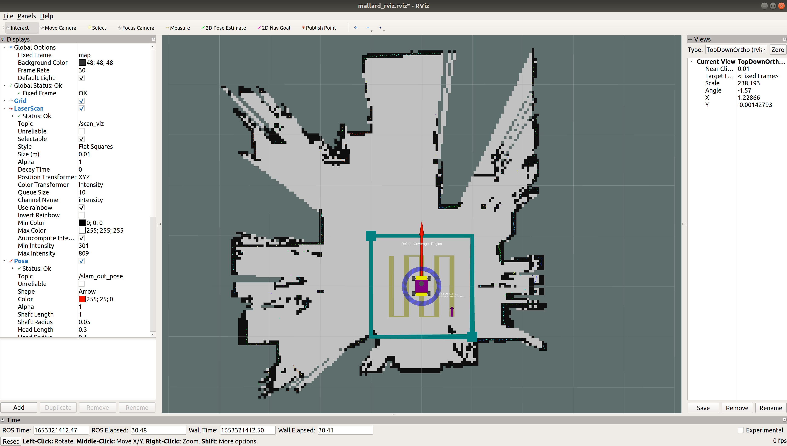 

2. In another terminal(Terminal 3), run the following commands.
```
rosparam set /hector_mapping/map_update_distance_thresh 1000    # in meters
rosparam set /hector_mapping/map_update_angle_thresh 1000       # in radians
```

3. Now you will be able to see that the map no longer updates when El-MallARD moves around.  

You can make the map update again by decreasing the thresholds with the following commands.   
```
rosparam set /hector_mapping/map_update_distance_thresh 0.4     # default
rosparam set /hector_mapping/map_update_angle_thresh 0.06       # default
```

-----

## sshfs (optional, recommended)
You can directly access to the folders and files in the robot computer on the base station using `sshfs`.  

You can make a folder called `ssh_mount` on the base station and mount the folders and files of the robot computer on the folder `ssh_mount` with the following commands.

On the base station,
```
mkdir ~/ssh_mount   #make a folder called ssh_mount

#after connecting to 'elmallard-UP-CHT01'
sshfsel             #mount the folders and files of MallARD-003 on the folder ssh_mount on the base station.
# insert password
```

Now you should be able to access the folders and files at `~/ssh_mount`.  

To unmount or when `sshfsel` command doesn't work, you might need to run the following command first and then try again.
```
sshfsunmount
```


-----

## El-MallARD's Embedded System
There are 5 microcontrollers in El-MallARD. 1 Master microcontroller and 4 Slave microcontrollers. If you want to make changes in El-MallARD's embedded system codes, refer to [El_MallARD_Arduino](https://github.com/EEEManchester/El_MallARD_Arduino).
