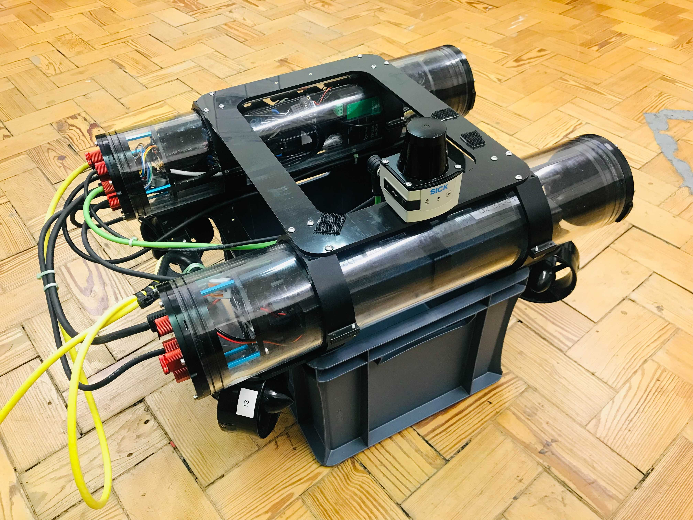
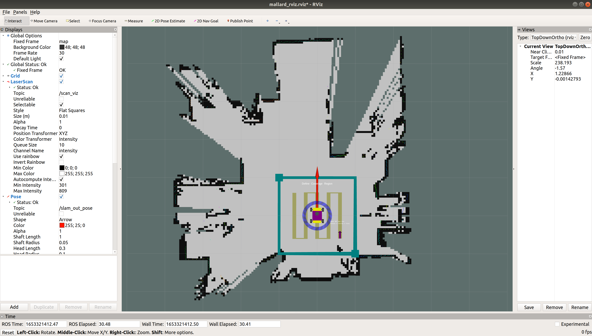

# MallARD-002
MallARD-002 is the second version of MallARD. It has a new thruster layout relative to MallARD-001 as described in [this paper](https://www.mdpi.com/2218-6581/8/2/47).  

 


**Please make sure you have followed [README.md](README.md) upto *.bashrc setup* section first.**  
For **passwords**, ask **Keir Groves**.  
For a **quick start**, go to **Run MallARD**.

-----


## Dependencies
### ssh connection problem
While following the instructions below, if there is a problem regarding ssh connection, you might need to [install OpenSSH Server](https://ubuntu.com/server/docs/service-openssh) on both computers.


## .bashrc setup
Add the following to `.bashrc` file on the `MallARD`'s computer if it has not been added yet. You can open `.bashrc` using `gedit ~/.bashrc` command on a terminal.
```
#For ROS path
source ~/mallard_ws/devel/setup.bash

#For default Environment Variable setup
export ROS_MASTER_URI=http://192.168.0.83:11311
export ROS_HOSTNAME=192.168.0.83

export MALLARD_VERSION='002_REAL'
export MALLARD_AUTONOMOUS=1

#For Autonomy setup
alias setman='export MALLARD_AUTONOMOUS=0'
alias setauto='export MALLARD_AUTONOMOUS=1'

#For robot launch
alias start_robot='roslaunch launch_config mallard_robot.launch'

#For arm/disarm
alias arm='rosservice call /mavros/cmd/arming "value: true"'
alias disarm='rosservice call /mavros/cmd/arming "value: false"'

#For shutdown
alias shut_robot='sudo shutdown -h now'
```


When you have added the above, source the file using the following command.
```
source ~/.bashrc
```


-----
## Run MallARD
### Connect MallARD
On MallARD-002,  

1. Connect the yellow cable from the robot to the power box and the Ethernet cable to the other side of the power box.


2. Turn on MallARD-002 by PULLing the red button of the power box. You should be able to hear three short consecutive beeps and two other short consecutive beeps a few seconds later. If that's the case, the robot computer (an UP board) is on and the Pixhawk 4 and the thrusters are ready for use.


On the base station,  

3. Connect the Ethernet cable to the base station.


### IP setup
MallARD-002 is connected to the base station via ethernet (wired connection).

On **MallARD-002**,  
the wired network needs to be set as follows (**It should have already been set on MallARD-002.**).


 


On the **base staion**,  
the wired network needs to be set as follows.


If you use a USB adaptor to connect the Ethernet cable, use the USB Ethernet setting. Otherwise, use PCI Ethernet setting.


### Run MallARD-002 as Manual Mode

On the base station, 

1. Connect a joypad to the base station.

2. In a terminal(Terminal 1), run the following commands and wait for 30 seconds for it to be fully launched.
```
ssh002
# insert password. When conneting for the first time, you might need to insert 'yes' first.
# now you are in the robot's onboard computer.

#set to Manual Mode for the current terminal
setman

#start robot
start_robot
```

3. In another terminal(Terminal 2), run the following commands.
```
#set environment variables to use El-MallARD
setmas002
setver002

#set to Manual Mode for the current terminal
setman

#start basestation
start_basestation
```

4. In another terminal(Terminal 3), run the following commands to arm/disarm the thrusters.
```
ssh002
# insert password

arm #to enable the thrusters

#You can use the following to disarm the thrusters.
disarm #to disable the thrusters
```

5. The thrusters should move as you control with the joypad  (Left joystick for linear movement and Right joystick for rotation).   

After use,

6. Shutdown the processes by pressing Ctrl + C in all the terminals.

7. Shutdown the UP board (the robot computer) properly with the following command in Terminal 1 or 3.
```
shut_robot
# insert password
```

Wait 1+ minutes for the UP board to completely shutdown.

8. Turn off MallARD-002 by pressing the red button of the power box. 


### Run MallARD-002 as Autonomous Mode
On the base station, 

1. Connect a joypad to the base station.

2. In a terminal(Terminal 1), run the following commands and wait for 30 seconds for it to be fully launched.
```
ssh002
# insert password
# now you are in the robot's onboard computer.

#set to Autonomous Mode for the current terminal
setauto

#start robot
start_robot
```

3. In another terminal(Terminal 2), run the following commands.
```
#set environment variables to use El-MallARD
setmas002
setver002

#set to Autonomous Mode for the current terminal
setauto

#start basestation
start_basestation
```

You should see windows similar to the followings:

#### rqt
 

#### RViz
 

4. In another terminal(Terminal 3), run the following commands to arm/disarm the thrusters.
```
ssh002
# insert password

arm #to enable the thrusters

#You can use the following to disarm the thrusters.
disarm #to disable the thrusters
```

5. The thrusters and MallARD-002's representation in RViz should move as you control with the joypad  (Left joystick for linear movement and Right joystick for rotation).  

6. Adjust the trajectory as you wish by dragging the purple cube, the green cubes, or the blue circle.

 

7. Right Click on the purple cube in the RViz window and Click 'Confirm Coverage' to start autonomous trajectory following. You can cancel it by Right Click on the purple cube and Click 'Cancel'.

 

The red arrow represents the heading of the robot. If the robot is on water, the robot will start moving to the starting point (purple arrow) and start moving along the trajectory (yellow lines). If the robot is not on water, the robot will not move. You should be able to see the thrsuters running.

You can cancel autonomous trajectory following by Right Click on the purple cube and Click 'Cancel'.

8. Follow the steps 6 to 8 of **Run MallARD-002 as Manual Mode**. 

---
## Fixing the map
When MallARD tilts on the water, it might see outside beyond the wall, which can cause its map being distorted and hence its localisation failing. To prevent this, you can fix the current map by stopping the map being updated. You can do this by increasing the angle and distance thresholds for the map to update. Refer to [EEEManchester/hector_slam](https://github.com/EEEManchester/hector_slam/tree/mallard).  

### Improvement

Without fixing the map:
- The map can get permanently corrupted.
- Once the map gets corrupted, the robot might not be able to perform localisation correctly.

With fixing the map:
- The correct map initially created can stay uncorrupted.
- The robot can perform localisation correctly on the fixed map.
- Even when the robot goes outside the fixed map and therefore failes to localise itself, once it comes back inside the fixed map, the robot can perform localisation correctly on the fixed map with manually setting 2D pose estimate in RViz.

### Steps

1. Complete the map first.
<!--   -->

2. In another terminal(Terminal 4), run the following commands.
```
rosparam set /hector_mapping/map_update_distance_thresh 1000    # in meters
rosparam set /hector_mapping/map_update_angle_thresh 1000       # in radians
```

3. Now you will be able to see that the map no longer updates when El-MallARD moves around.  

You can make the map update again by decreasing the thresholds with the following commands.   
```
rosparam set /hector_mapping/map_update_distance_thresh 0.4     # default
rosparam set /hector_mapping/map_update_angle_thresh 0.06       # default
```

-----

## sshfs (optional, recommended)
You can directly access to the folders and files in the robot computer on the base station using `sshfs`.  

You can make a folder called `ssh_mount` on the base station and mount the folders and files of the robot computer on the folder `ssh_mount` with the following commands.

On the base station,
```
mkdir ~/ssh_mount   #make a folder called ssh_mount

#after connecting to the robot via the Ethernet cable.
sshfs002           #mount the folders and files of MallARD-002 on the folder ssh_mount on the base station.
# insert password
```

Now you should be able to access the folders and files at `~/ssh_mount`.  

To unmount, you the following command. Also, when `sshfs002` command doesn't work, you might need to run the following command first and then try again.
```
sshfsunmount
```


-----
## ssh warning
You might see the following warning when connecting to MallARD-002 after connecting to MallARD-003 or vice versa. 

When you run the ssh command,
```
ssh002
```

the following might appear.
```
@@@@@@@@@@@@@@@@@@@@@@@@@@@@@@@@@@@@@@@@@@@@@@@@@@@@@@@@@@@
@    WARNING: REMOTE HOST IDENTIFICATION HAS CHANGED!     @
@@@@@@@@@@@@@@@@@@@@@@@@@@@@@@@@@@@@@@@@@@@@@@@@@@@@@@@@@@@
IT IS POSSIBLE THAT SOMEONE IS DOING SOMETHING NASTY!
Someone could be eavesdropping on you right now (man-in-the-middle attack)!
It is also possible that a host key has just been changed.
The fingerprint for the ECDSA key sent by the remote host is
...
Please contact your system administrator.
Add correct host key in /home/(user)/.ssh/known_hosts to get rid of this message.
Offending ECDSA key in /home/(user)/.ssh/known_hosts:6
  remove with:
  ssh-keygen -f "/home/(user)/.ssh/known_hosts" -R "192.168.0.83"
ECDSA host key for 192.168.0.83 has changed and you have requested strict checking.
Host key verification failed.
```

This is because both robots have the same IP address. You can resolve this issue by running the command in the warning.  

Run the following command ('user' is the user name of the computer').
```
ssh-keygen -f "/home/(user)/.ssh/known_hosts" -R "192.168.0.83"
```

Then the following will appear.
```
# Host 192.168.0.83 found: line 6
/home/(user))/.ssh/known_hosts updated.
Original contents retained as /home/gyal/.ssh/known_hosts.old
```

Then try the ssh command again.
```
ssh002
```

Then the following will appear. Say yes and insert the password.
```
The authenticity of host '192.168.0.83 (192.168.0.83)' can't be established.
ECDSA key fingerprint is SHA256:Gkjpg87wobp9j/Cm60gclaOHxLVOnJbr8gqgqxYNdoA.
Are you sure you want to continue connecting (yes/no)? yes
Warning: Permanently added '192.168.0.83' (ECDSA) to the list of known hosts.
mallard@192.168.0.83's password: 
```

-----

## Pixhwak setup
If you want to setup the Pixhwak of MallARD, refer to [ArduPilot_MALLARD](https://github.com/EEEManchester/ArduPilot_MALLARD).